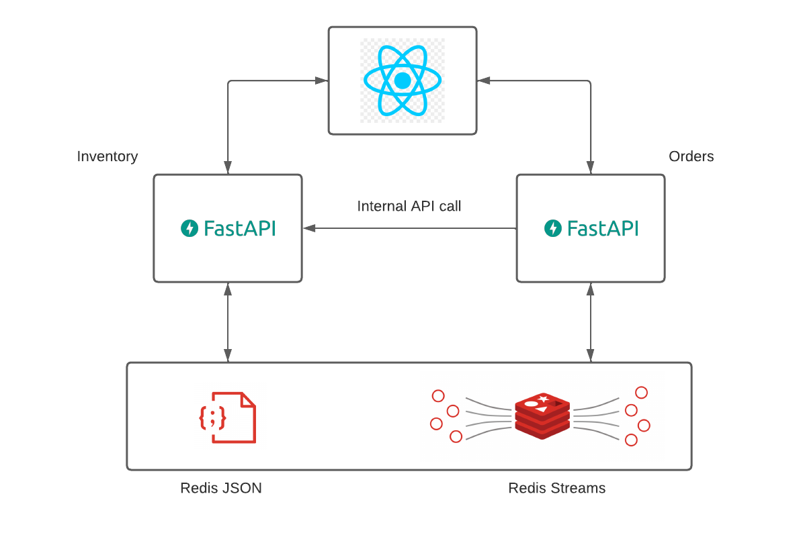
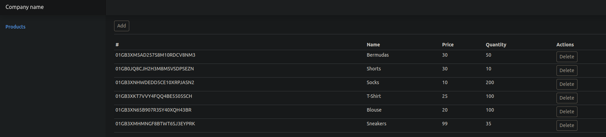
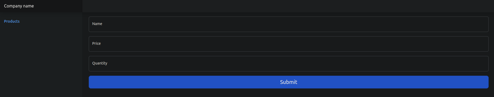
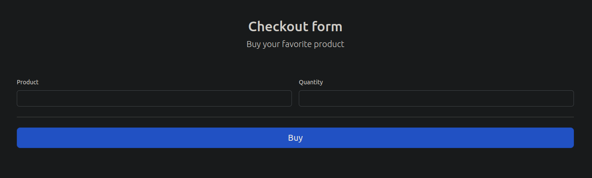
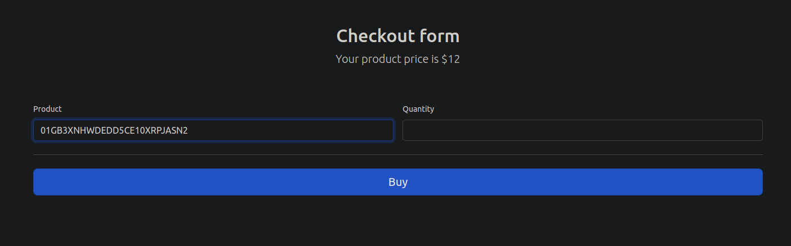

<h4 align="center"> 
	🚧 Microservices with FastAPI, an introduction 🚧
</h4>

  

 
	
  
  
  

# **Objective**
_This is a fictional project and only for study purposes_

The purpose of this project is to build a simple microservices app to make 2 endpoints communicate to each other.
The first one is an inventory microservice, where products data will be stored, and the other one will provide a platform
to make an order/purchase of a certain product.

# **Tools**

For this project, FastAPI was used to hold the application backend and the framework is made with React.
The data will be stored in a Redis cloud infrastructure with Redis JSON, which is a tool that retrieves
JSON values to a database, and the events will be sent from one microservice to another using Redis Streams. A Redis Stream is 
a data structure that works as an append-only log and is responsible to record and send events in real time.

A Bootstrap template was used. This template can be found at https://getbootstrap.com/docs/5.2/examples/dashboard/

 Figure 1 - Architecture used

<h1 align="center"> 

</h1>

# **Pages**

## Home Page
Firstly, the user can have access to the page through its index, which contains the list of products with their prices and quantity on stock.
It is possible to delete a product from the list.

 Figure 2 - Index Page

<h1 align="center">    
    
</h1>

## Add a new product (/create)

The user is able to click in the "Add" button in the homepage and submit a new product through the form in figure 3.

 Figure 3 - Add Product Form

<h1 align="center">    
    
</h1>

## Add a new order (/orders)
It is possible to create a new order through the form in figure 4. In order to submit, the user must have the product id.

 Figure 4 - Login Form

<h1 align="center">
    
</h1>

As the user inserts the product id, the price is informed before the user specifies the quantity of products to get.

 Figure 5 - Filling the Form

<h1 align="center">
    
</h1>
